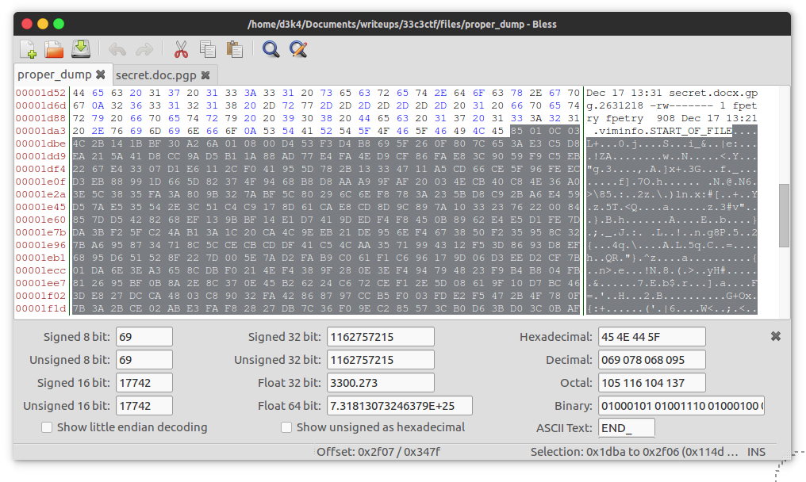
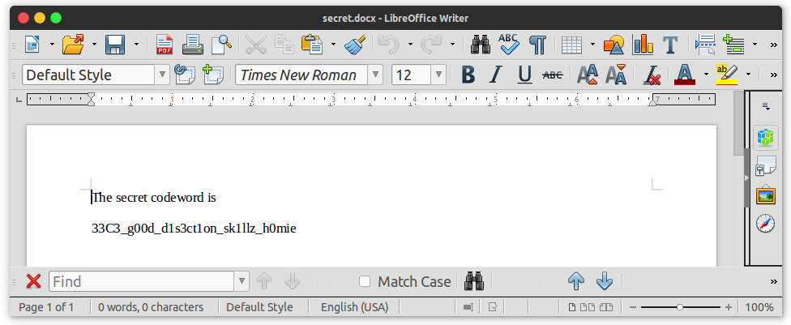

# **exfil** - 100 точки
**33c3ctf/forensic**

Solves: **140** 
> We hired somebody to gather intelligence on an enemy party. But apparently they managed to lose the secret document they extracted. They just sent us [this](https://archive.aachen.ccc.de/33c3ctf.ccc.ac/uploads/exfil-e5e0066760f0dd16e38abc0003aec40f39f9adf9.tar.xz) and said we should be able to recover everything we need from it. Can you help?


След като изтеглим файла, виждаме че в него има прихванат **мрежов трафик** и **python скрипт**. Преглеждайки трафика виждаме че е прихваната комуникацията между **клиент(192.168.0.121)** и **сървър(192.168.0.1)**. Python скрипта представлява DNS сървър за 'криптирана' комуникацията с клиента.
Целта ни е да декриптираме трафика и да извлечем тайните от него.

Темите който ще засегнем:
* **Мрежи**
* **Протоколи**

Допълнително:
* **python/scapy**

Една малка демонстрация колко е лесно e да се борави с да се прави дисекция на мрежов трафик посредством Python библиотеката Scapy. Това представлява DNS пакета зареден в python terminal:

[](https://asciinema.org/a/98619?speed=2)

Нека се направим бърза проверка какво имаме в [*.pcap файла](files/exfil/dump.pcap).

```
Welcome to Scapy (2.3.3)
>>> p=rdpcap("exfil/dump.pcap")
>>> p.summary
<bound method PacketList.summary of <dump.pcap: TCP:0 UDP:1804 ICMP:0 Other:0>>
```
Имаме **1804 пакета** DNS комуникацията през UDP.В трафика намира DNS Queries и DNS Answer пакети. 

Връщаме се обратно към задачата, нека проследим [кода на сървъра](files/exfil/server.py) който ни е даден за да разберем как биват обработвани DNS пакетите и каква им е структурата.

Пакетите са енкодирани в `base32` и разделени в 62-char chunks, за да се оплатни дължината на domain name-а в DNS пакета. Тези chunks са разделени с `.` и завършват с домейна `.eat-sleep-pwn-repeat.de`.

```python
...
def process_packet(self, packet):
        assert len(packet) >= 6

        conn_id, seq, ack = struct.unpack('<HHH', packet[:6]) # първите 6 байта са за за следене на сесията 
...
domain = 'eat-sleep-pwn-repeat.de' # този домейн е част от всяка заявка, трябва да бъде премахнат по-време на дисекцията

```


Време е да започнем да разглеждаме трафика който ни е даден. Ето част от кода който написах за да прегледаме за каквао става дума в мрежовия трафик:

``` python
# kopirano ot server.py
def decode_b32(s):
    s = s.upper()
    for i in range(10):
        try:
            return base64.b32decode(s)
        except:
            s += b'='
    raise ValueError('Invalid base32')
# ---

def parse_payload(a):
    try:
        data = a.split('.')
        data = data[:data.index('eat-sleep-pwn-repeat')]
        return decode_b32(''.join(data))
    except:
        return None

def load_packets():
    p=rdpcap("exfil/dump.pcap")
    print p.summary
    for packet in p:
        data = packet.payload
        try:
            print parse_payload(data.an.rdata)
        except:
            pass
        try:
            print parse_payload(data.qd.qname)
        except:
            pass

load_packets()
```

Започваме анализа на [това](files/dump) което сме успяхме да генерираме от скрипта. Това е началото:

```
uid=1001(fpetry) gid=1001(fpetry) groups=1001(fpetry)
```

Излгежда някой е отворил `reverse shell`, зашото първата му команда е `id` (да провери с каквъв достъп разполага), следва `ls` на директорията в която се намира. Вероятно е изтеглил някакви файлове от там. Целта е да разберем кой точно файлове, и дали можем да ги екфилтрираме от трафика. 

```
2631216 -rw-r--r-- 1 fpetry fpetry 4.0K Dec 17 13:17 secret.docx
2631222 -rw-rw-r-- 1 fpetry fpetry 4.4K Dec 17 13:31 secret.docx.gpg
```

от това което видях в dumpa-а това са интерсните файлове който може би са някъде в трафика - товава заключение правим от следните редове:

```
START_OF_FILE
=END_OF_FILE
```

За да продължим оттук нататък трябва да разграничим различните видове комуникация. След по-детайлно изследване на кода предположението ми за reverse shell сесия се оказва правилно:

1. Командите са изпратени в CNAME responses на DNS заявките
2. Файловете и оутпута на командите са в заявките(DNS Queries)


Време е да си окрасим gypsy кода за да направим по-добро отсяване на нещата които ни трябват и тези без който можем да минем.

Не трябва да забравяме че това е UDP трафик и много от пакетите ще имат дубликати, извинявам се предварително за грозния код но с това успях да измисля:

```python
from scapy.all import * 
import struct
import sys

session_count = 1

# kopirano ot server.py
def decode_b32(s):
    s = s.upper()
    for i in range(10):
        try:
            return base64.b32decode(s)
        except:
            s += b'='
    raise ValueError('Invalid base32')


def parse_payload(a):
    try:
        data = a.split('.')
        data = data[:data.index('eat-sleep-pwn-repeat')]
        data = decode_b32(''.join(data))
        (conn_id, seq, ack) = struct.unpack('<HHH', data[:6])
        return seq, data[6:]

    except:
        return None


def load_packets():
    p=rdpcap("exfil/dump.pcap")

    seq_q = [] # dns vaprosi
    seq_a = [] # dns otgovori

    # obrabotvame vseki paket
    for packet in p:
        if packet and packet.haslayer('UDP') and packet.haslayer('DNS'):
            if packet.an is None:
                try:
                    a = parse_payload(packet.qd.qname) 
                    if a != None:
                        seq_q.append(a)
                except:
                    pass
            else: 
                try:
                    a = parse_payload(packet.an.rdata) 
                    if a != None:
                        seq_a.append(a)
                except:
                    pass

    return seq_q , seq_a 

# tazi funciq maha dublikati i podrejda paketite
def fuck_udp(a):
    global session_count
    if len(i[1]) <= 0:
        return
    if i[0] > session_count:
        session_count = i[0]
        sys.stdout.write(i[1])
    else:
        return

# generirane na 2 lista s DNS query and DNS answers
q, a = load_packets()

# obrabotka na lista s DNS A
for i in a:
    fuck_udp(i)

# zanulqvame broqcha za sessite
session_count = 0

# obrabotka na lista s DNS Q
for i in q:
    fuck_udp(i)
```

Посредством [този скрипт](files/solve_exfil.py), успях да генерирам следния четим [dump](files/proper_dump). 

Вече можем да разграничим различните изпълнени команди, ексфилтрирани файлове и какво точно се е случило:
1. След като някой е отворил reverse shell-a е paste-нал своите PUBLIC и PRIVATE keys в файла `key`([ето го и копието](files/key)), след което ги е импортирал в `gpg`
2. Посредством ключа е криптирал файла `secret.docx` --> secret.docx.gpg([ето го и копието](files/secret.doc.pgp)), изтеглил го е и след това го е изтрил.




```
d3k4@d3k4-XPS:~/Documents/writeups/33c3ctf/files$ gpg --import key
gpg: key D0D8161F: "operator from hell <team@kitctf.de>" not changed
gpg: key D0D8161F: secret key imported
gpg: key D0D8161F: "operator from hell <team@kitctf.de>" not changed
gpg: Total number processed: 2
gpg:              unchanged: 2
gpg:       secret keys read: 1
gpg:   secret keys imported: 1

d3k4@d3k4-XPS:~/Documents/writeups/33c3ctf/files$ gpg --decrypt --recipient team@kitctf.de secret.doc.pgp > secret.docx
gpg: encrypted with 2048-bit RSA key, ID BF30A26A, created 2016-12-11
      "operator from hell <team@kitctf.de>
```

Декриптирания файл: [тук](files/secret.docx)



Ето го и флага:

```
33C3_g00d_d1s3ct1on_sk1llz_h0mie
```

Ако не ползвате виртуална машина(като мен), да не забравите да изтриете ключа:

```
gpg --delete-secret-key 'operator from hell <team@kitctf.de>
gpg --delete-key 'operator from hell <team@kitctf.de>'
```


