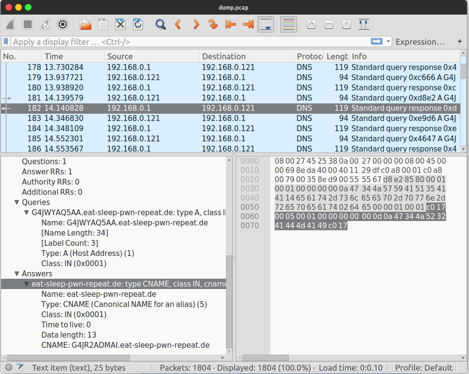

# **exfil** - 100 точки
**33c3ctf/forensic**

Solves: **140** 
> We hired somebody to gather intelligence on an enemy party. But apparently they managed to lose the secret document they extracted. They just sent us [this](https://archive.aachen.ccc.de/33c3ctf.ccc.ac/uploads/exfil-e5e0066760f0dd16e38abc0003aec40f39f9adf9.tar.xz) and said we should be able to recover everything we need from it. Can you help?



След като изтеглим файла, виждаме че в него има прихванат **мрежов трафик** и **python скрипт**. Преглеждайки трафика виждаме че е прихваната комуникацията между **клиент(192.168.0.121)** и **сървър(192.168.0.1)**. Python скрипта представлява DNS сървър за криптирана комуникацията с клиента.
Целта ни е да декриптираме трафика и да извлечем тайните от него.

Темите който ще засегнем:
* **Мрежи**
* **Протоколи**
* **Криптография**

Допълнително:
* **python/scapy**

Една малка демонстрация колко е лесно e да се борави с прихванати посредством Python библиотеката Scapy. Това представлява DNS пакета зареден в python terminal:

[](https://asciinema.org/a/98619?speed=2)

Нека се направим бърза проверка какво имаме в [*.pcap файла](files/exfil/dump.pcap).

```
Welcome to Scapy (2.3.3)
>>> p=rdpcap("exfil/dump.pcap")
>>> p.summary
<bound method PacketList.summary of <dump.pcap: TCP:0 UDP:1804 ICMP:0 Other:0>>
```
Имаме **1804 пакета** DNS комуникацията през UDP.В трафика намира DNS Queries и DNS Answer пакети. 

Връщаме се обратно към задачата, нека проследим [кода на сървъра](files/exfil/server.py) който ни е даден за да разберем как биват обработвани заявките.

```python
...
def process_packet(self, packet):
        assert len(packet) >= 6

        conn_id, seq, ack = struct.unpack('<HHH', packet[:6]) # първите 6 байта са за за следене на сесията, <scapy> автомачично ще ги обработи
        data = packet[6:]
...
domain = 'eat-sleep-pwn-repeat.de' # този домейн е част от всяка заявка, трябва да бъде премахнат по-време на дисекцията
```

