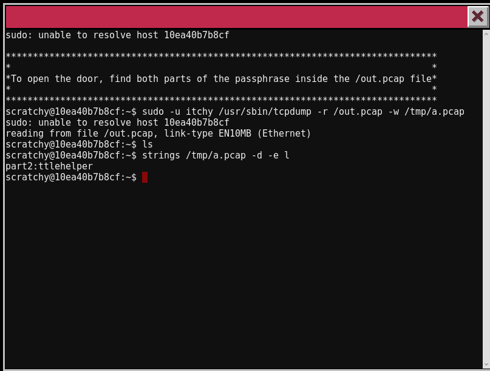
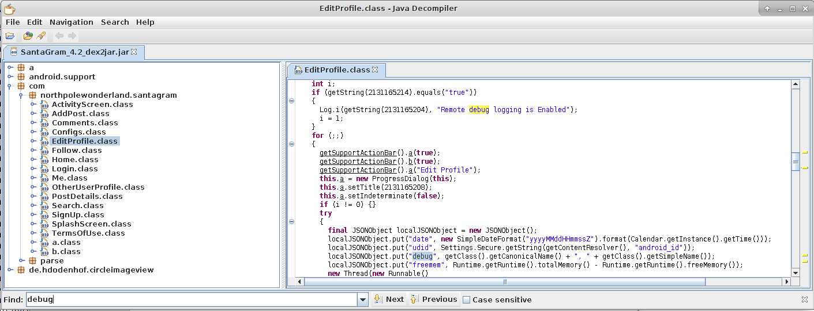
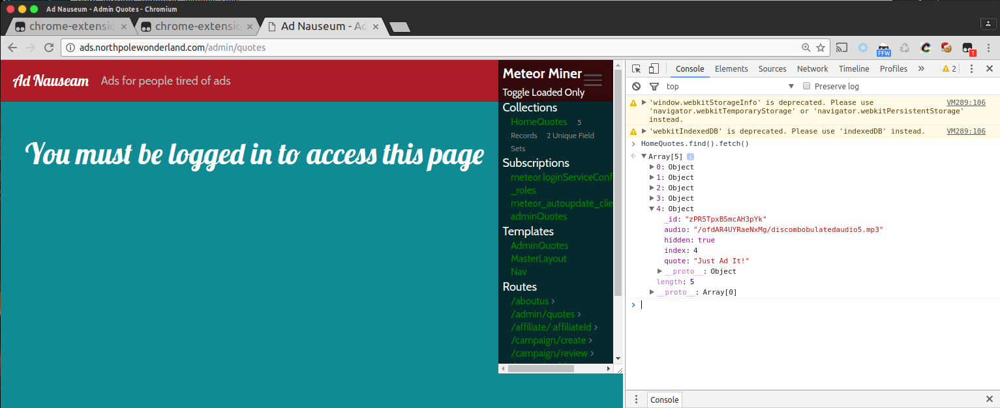

# **SANS Christmas Challenge 2016**
## Записки от последната [кибер игра на SANS Institute](https://www.holidayhackchallenge.com/2016/).


# **Part 1: A Most Curious Business Card** 
## 1) What is the secret message in Santa's tweets?
## 2) What is inside the ZIP file distributed by Santa's team?

Миналата година ми отне 2 седмици за да реша challenge-а(естествено покрай работата). Това според мен е една от най интерактивните CTF състезания правени досега.И ето го и [примера](images/old-school.png), освен сложната loadbalanced инфраструктура(която се предполага че трябва да издържа трафрик заради сканирания и brute-force атаките) имаме и 2D RPG модел. Ако се загледате в [credits](https://www.holidayhackchallenge.com/2016/#Credits), ще разберете повече за екипа.

Започваме с [въведението](files/intro.txt). Прочитаме интрото и си правим 2 обобщения:

> 1) ще търсим Дядо Коледа
> 2) всяка следа която открием трябва да бъде асоциирана с Коледа

Отговора на първия въпрос явно е скрит в [twitter акаунта на стареца](https://twitter.com/SantaWClaus) (виж [картичката](https://www.holidayhackchallenge.com/2016/images/santas_business_card_logo.png)). Ако сте редовни играчи на CTF може да сте си загубили около 30мин в разкостване на бизнес картичката, която се е с размер 3.33mb - `3,3M	santas_business_card_logo.png`, а това си изглежда съмнително но уви.

В board-а на twitter акауна забелязваме много странни постове, задачата е проста - да ги декодираме.

Ако често правите OSINT има голяма вероятност да имате скрипт като [този](files/santa_get_2.py), и готов акаунт в twitter dev. Иначе можете да го направите и на ръка но ще ви отнеме повече време.
Всеки един от tweet-вете трябва да се копира като нов ред в текстов файл, за да получим един [ascii-art](images/BUGBOUNTY.png) с отговора на пърия въпрос:


> BUGBOUNTY

Преминаваме веднага на втория въпрос от 1вата част на играта - трябва да намерим скрит ZIP файл. Крачка назад към [картичката](https://www.holidayhackchallenge.com/2016/images/santas_business_card_logo.png). Ако внимателно се вгледаме ще видим че освен twitter, има и [instagram account](https://www.instagram.com/santawclaus/).


Оглеждаме 3те снимки, си отговаряме и на 2рия въпрос:
* `SantaGram_v-4.2.zip`
* `www.thenorthpolewonderland.com`


> И ето че намерихме къде е [zip файла](http://northpolewonderland.com/SantaGram_v-4.2.zip).

 Използваме паролата **bugbounty** като парола за да го разархивираме. Явно в следващата част 2ра от състезанието ще се занимаваме с това [java приложение за android](files/SantaGram_4.2.apk).

# **Part 2: Awesome Package Konveyance** 
## 3) What username and password are embedded in the APK file?
## 4) What is the name of the audible component (audio file) in the SantaGram APK file?

3-ти въпрос е ясен, трябва да декомпилираме апликацията и да намерим някакво име и парола. За да направим това ще трябва да знаем че **.apk**, като [.jar файловете](https://docs.oracle.com/javase/tutorial/deployment/jar/basicsindex.html), могат лесно да бъдат декомпилирани за да се извлича съдържанието им.

След като разгледаме файловата структура с бърза оборка, се отправяме към интересния файл classes.dex , който по презумция трябва да съдържа Java класовете на апликацията - [какво е .dex format](https://source.android.com/devices/tech/dalvik/dex-format.html). Ще ни е необходима и помощ и от [ето този tool](https://github.com/pxb1988/dex2jar) за да декомпилираме този файл. Ето как:

[](https://asciinema.org/a/96390)

По-нататък ще покажа и 2ри начин за декомпилиране и повторно компилиране на андройд апликация, но за сега това е достатъчно.

Файлът **classes_dex2jar.jar** може също да бъде разархивиран или импортиран в [jd-gui](https://github.com/java-decompiler/jd-gui). 

Аз избирам втория вариант заради по-бързото търсене.
В **com.northpolewonderland.santagram.b** класа намираме следния код, който се явява и отговора на 1вия ни въпрос.
```
...
localJSONObject.put("username", "guest");
localJSONObject.put("password", "busyreindeer78");
...
```
> guest , busyreindeer78

Отговорът на въпрос 4 се намира в директорията на 1вия разархивиран файл - [/res/raw/discombobulatedaudio1.mp3](files/discombobulatedaudio1.mp3)

> discombobulatedaudio1


# **Part 3: A Fresh-Baked Holiday Pi** 
## 5) What is the password for the "cranpi" account on the Cranberry Pi system?
## 6) How did you open each terminal door and where had the villain imprisoned Santa?

Време е да се отправим към [играта](https://quest2016.holidayhackchallenge.com/), правим си регистрация и я обикаляме цялата докато не съберем всички части от така нареченото [Cramberry Pi](images/2016-12-17-02-07-31.png).
След което трябва да говорите с [Holly Evergeen](images/2016-12-17-02-11-25.png), това е някакъв елф в самото начало на картата. Той ще ви даде да изтеглите [firmware image](https://www.northpolewonderland.com/cranbian.img.zip).

Указанията как да mount-нем този имидж към текущата файлова система, за да разгледаме съдържанието и да намерим паролата на потребителя **cranpi**:

[](https://asciinema.org/a/96399)

Резултата е следния хеш:
`cranpi:$6$2AXLbEoG$zZlWSwrUSD02cm8ncL6pmaYY/39DUai3OGfnBbDNjtx2G99qKbhnidxinanEhahBINm/2YyjFihxg7tgc343b0:17140:0:99999:7:::`

Някъде докато се лутах из RPG играта попаднах на елф който ми подсказа че трябва да използваме [rockyou.txt](http://downloads.skullsecurity.org/passwords/rockyou.txt.bz2) файл като речник за декриптиране на пароли. Така и направих, с помоща на [johntheripper](http://www.openwall.com/john/) и подсказката на елфа успях да декриптирам паролата за 10мин.

> yummicookies

Продължаваме със следвашия въпрос за "Как успяхте да отворите всичките терминали?"

### Терминал 1

Тук трябва да използваме познанията си по *unix за да намерим начин за privillege escalation. Това ни е необходимо за да можем да прочетем network dump файла **out.pcap**, намиращ се в **/** директорията на системата и принадлежащ на user **itchy**. Как да направим екалацията ни се подсказва след изпълнението на следната команда:


Извода е че можем да изпълняваме следните две команди - `tcpdump` и `strings`, от името на itchy без да се налага да въвеждаме парола. 


Първата част от паролата вероятно е `santasli`, втората част от парола се намира в изтеглен bin файл от `/out.pcap`.


Както сами виждате трудните задачи тепърва предстоят. За да продължим е нужно да сме се запознали с функцийте на `tcpdump` и като допълнение да изпозлваме папката `/tmp` защото почти винаги всички потребители имат права за четене и писане в нея.
Имайте в предвид че връзката с импровизирания терминал [не е мн надежна](images/connection_dropped.png), и може от време на време да ви изхвърля. Това е много дразнещо докато се опитвате да си настройте командите.

Посочения файл съдържа комукацията между 192.168.188.1 (клиент) и 192.168.188.130(сървър), на нас ни е обходим трафика идващ от 2рия IP адрес. Тъй като не съм гуру на `tcpdump` не можах да екстрактна файла `secondpart.bin`, но намерих work-around посредством [chaosreader.pl](https://raw.githubusercontent.com/brendangregg/Chaosreader/master/older_versions/chaosreader0.94) - тъй като видях че поддържа `perl`. 
Стъпките са следните:
1. `sudo -u itchy /usr/sbin/tcpdump -r /out.pcap -w /tmp/out.pcap`
2. `perl chaosreader.pl /tmp/out.pcap` - _ще разберем в последствие че това уражнение не беше нужно_

В моя случай резултата от тези операций беше да взема `*.data` файла от втората сесия който се явява `secondpart.bin`.

Като видите какво е решението на задачата ще разберете че тези стъпки не са ми били нужни, но все пак си загубих 2ч в мислене как да екстратна тази информация от файла с трафика. Over-thinking-а на такива задачи може сериозно да ви загуби времето. Този challenge можеше да реши на един ред. Няма да ви занимавам точно през какво съм минал, но нямаше да се справя без помоща на приятел. 

Ето го и решението, ключа е да бъде използван `strings` с подходящ енкодинг(`i`) -little endian):



Втората част на паролата е `ttlehelper`
> santaslittlehelper

Първия терминал е отворен!

## Терминал 2 

Следващия [терминал](images/terminal2.png) който намерих се намира в най-северната част на картата, а по точно в 'Workshop', там трябва да говорите един от елфите.

Новата ни цел е да намерим паролата скрита в играта [`Wumpus`](images/terminal2.png). 

Играта е тип, лабиринг с **2 команди**
* `move` 
* `shoot` 

Допълнителните оказания са:
* 20 стай
* вска стая с по 3 тунела водещи към други стай
* 3 прилепа
* 3 ями
* 5 стрели за трепане

Ясно нужно е да промушим една от стрелите в бинарника на Wumpus. Докато се разхождах по картата говорих с някакъв елф, който ми каза че можело да се cheat-ва. Поиграх си известно време с играта, помъчих се да рисувам карти на лабиринта. Имаше и няколко бъда или екстри:
* създаване на локален файл - `wump.info`, който съдържа липсващите инструкций, но не ми помогна много. 
* може да се изтрелват стрели, примерно в стая с номер **999**, и тогава се случват някакви според мен random процеси.

Така и не открих начин да излъжем играта в web терминала. На който му се занимва, успях да изгледа файла локално в [base64](files/wumpus.txt) и [*.bin](files/wumpus.bin). На локално ниво можем директно да направим `jmp` директно към функцията `kill_wump` и сме готови. 

> WUMPUS IS MISUNDERSTOOD


## Терминал 3

Ето го [решението ми](https://vid.me/CFdu) за следващия терминал целта е да се вземе fullpath на много забутан файл в `~/` и да се `cat`-не. 


Като допълнително усложнение е че версията на `bash` беше много стара, нямаше auto-completion и общо взето терминала си правеше каквото си иска с цел да ни попречи да стигнем бързо до ключа. Една команда беше достатъчна да вземем ключа. 


> open_sesame

Използваме паролата за да влезем през вратата. Която ни отвежда в кабинета на Дядо Коледа, и поредния терминал висящ на стената.

## Терминал 4

`"GREETINGS PROFESSOR FALKON"`, колко познато. Това е много честа препратка към филма [WarGames](https://en.wikipedia.org/wiki/WarGames). За тези който не са го гледали до сега - предложението ми е да не го гледате. Но за '83 година идеята за нов **Skynet** си е била иновативна. След 20мин опити да разбера как точно работи, сега ще ви разкрия тайната. Отваряте [това видео](https://www.youtube.com/watch?v=uCWKZWieMSY) и започвате да имитирате разговора (имайте предвид че е case-sensitive + стоги препинателните знаци). A ето го и [отговора](images/terminal_wargames.png).

> LOOK AT THE PRETTY LIGHTS

## Терминал 5
Следващия терминал се намира в импровизирана станция на метро/влак(все тая).


Веднага успях да разпозная че това е [less](https://en.wikipedia.org/wiki/Less_(Unix)), и можем да изпълняваме команди като изпълним `!sh`, което ни отвежда до shell.

 

`Train_Console` се оказа shell script стартиращ `ActivateTrain` и съдържащ паролата за сваляне спирачките на влака.

> 24fb3e89ce2aa0ea422c3d511d40dd84

## Къде е Дядо Коледа?
Качваме се във влака, изключваме спирачките, и пуф-паф ... отвеждат ни [назад във времето](images/1978.png). Отправяме съм към мястото на Терминал 2. Визаме през вратата и откриваме Дядо Коледа, който междувремнно си е загубил паметта.


Живи и здрави приключишме и този quest и ако не се лъжа с 2D RPG играта с резултат 17/21 награди. С удоволствие бих се позанимавал още малко но утре сутрин заминавам към Хамбург за ежегодното [33c3](https://events.ccc.de/tag/33c3/). Нямам търпение да се позанимаваме и най-накрая с по-интересни задачи в **част 4**.


# **Part 4: My Gosh... It's Full of Holes** 
## 7) ONCE YOU GET APPROVAL OF GIVEN IN-SCOPE TARGET IP ADDRESSES FROM TOM HESSMAN AT THE NORTH POLE, ATTEMPT TO REMOTELY EXPLOIT EACH OF THE FOLLOWING TARGETS:
1. The Mobile Analytics Server (via credentialed login access)
2. The Dungeon Game
3. The Debug Server
4. The Banner Ad Server
5. The Uncaught Exception Handler Server
6. The Mobile Analytics Server (post authentication)

## 6)  What are the names of the audio files you discovered from each system above? There are a total of SEVEN audio files (one from the original APK in Question 4, plus one for each of the six items in the bullet list above.) 
> Please note: Although each system is remotely exploitable, we DO NOT expect every participant to compromise every element of the SantaGram infrastructure. Gain access to the ones you can. Although we will give special consideration to entries that successfully compromise all six vulnerabilities and retrieve their audio files, we happily accept partial answers and point out that they too are eligible for any of the prizes. 

CCC приключи, проспах Нова Година и почивния ден след нея. Понеделник е и остават 3 дни до края на SANS Christmas Challenge. Започваме час по скоро с 4та част от играта.

Задачите са ясни, ще ни е необходим някакъв екслойтеишън на отдалечени сървиси. Нека първо намерим url адресите в декомпилираната от 1вата част  [андроид апликация](files/SantaGram_4.2.apk) 
 

* http://dungeon.northpolewonderland.com/
* https://analytics.northpolewonderland.com/
* http://ads.northpolewonderland.com/
* http://dev.northpolewonderland.com/
* http://ex.northpolewonderland.com/

Като допълнение можем да видим и end-points за комуникация ако искалираме приложението на телефон и му направим Man-In-The-Middle атака:


## Development server
Докато си губих времето в разглеждане на функцийте на приложението видях, че липсват пакети към http://dev.northpolewonderland.com/, явно нещо ни липсва. Забиваме поглед в сорс кода(за да стигнем до сорс-а декомпилираме приложението). Необходими са ни:
* [apktool](https://ibotpeaches.github.io/Apktool/)
* [SignApk](files/SignApk.zip)
* [jd-gui](http://jd.benow.ca/)



Явно ни липсва някаква променлива да бъде сменена от `true` -> `false`, и апликацията ще започне да изпраща debug информация към dev.northpolewonderland.com.


Правим необходимите промени в 'strings.xml' и следва отново да [компилираме апликацията и да я подпишем](https://forum.xda-developers.com/showthread.php?t=2213985).

[](https://asciinema.org/a/23n3ucwivj120q2a8bbxk0d94)

Апликацията е инсталирана, и `debug_data_enabled` е `true`. Нека сега погледнем в трафика генериран от апликацията.


В отговора на заявката виждаме още един допълнителен ключ `verbose`. Добавяме го към първоначалната json заявка:

```
{"date":"20170105234113+0100","udid":"25768b88ce05e92d","debug":"com.northpolewonderland.santagram.EditProfile, EditProfile","freemem":74156920, "verbose": true}
```


Debug лога разкрива поредния mp3 файл скрит на web сървъра.
`http://dev.northpolewonderland.com/debug-20161224235959-0.mp3`

## Analytics Server

Продължаваме напред с следващата [цел](https://analytics.northpolewonderland.com/). Влизаме в уеб страницата като използваме паролите от които взехме в Част 2 от играта(и по точно от сорс-кода на андройд приложението).


Изтегляме файла `discombobulatedaudio2.mp3` от бутона **MP3**, и продължаваме напред.

Използваме [**dirb**](http://tools.kali.org/web-applications/dirb) за да bruteforce-нем файлове на уеб сървъра и откриваме че уеб сайта е деплойнат посредством git, нека се опитаме да извлечем съдържанието му. За челта използваме приложението [**dvcs-ripper**](https://github.com/kost/dvcs-ripper) 
[](https://asciinema.org/a/b21p5mic9d05ofg483pe07m69)

След като успешно клонираме git репозиторито, имаме достъп до сорс-кода на приложението. След ревя на кода разбираме, че ако сме администратори можем да достъпим `edit.php`, а алгоритъма за съставяне на валидна администраторска session cookie се намира в `crypto.php` (с бърз copy-paste си ненерираме такава cookie със следния [скрипт](files/crypto.php))
```
82532b2136348aaa1fa7dd2243dc0dc1e10948231f339e5edd5770daf9eef18a4384f6e7bca04d87e572ba65ce996549b549496163a50b63b71976884152
```
Заменяме **guest cookie** с прясно генерираната ни **администраторска**. И вече можем да видим допълнителната функция `edit.php`.

След 10мин тестове, разбрах как се решава задача. Идеята е да се **edit**-не **item** от базата данни като в параметъра **query** да му се зададе **custom sql query**, която по късно че бъде изпълнена с помоща на view.php.

Администраторската паролата може да бъде видяна от заявката от заявката:
```
/edit.php?id=749b17a7-565f-43f5-a3a3-2b90cf6dc7f4&name=id,dd,3d&description=hello&query=SELECT * FROM users;
```


Можейки да си комуникираме с базата данни, откриваме и къде се намира следващия аудио файл - а именнот в таблица **audio**.
Както можем и да извлечем следващия mp3 файл с подобна заявка но енкодиран в base64 или hex.

```
/edit.php?id=749b17a7-565f-43f5-a3a3-2b90cf6dc7f4&name=id,dd,3d&description=hello&query=SELECT id, CONCAT(TO_BASE64(mp3)) AS file_to_hex FROM audio; 
```


Копираме и генерираме аудио файла локално и сме готови и с тази част от играта.

## Ads Server

Отиваме на [адреса на challenge-a](https://ads.northpolewonderland.com/), и откриваме една от най-новите JavaScript фреймуърци за разработка на приложения - [Meteor](https://www.meteor.com/#!). Тъй като не съм правил тестове на подобно приложения се наложи да прочета документацията. Открих една снимка на архитектурата която смятам да ви споделя...


Най важните заключения от прочетеното:
* Клиент-сървър архитектурата;
* Клиента се намира във браузъра на потребителя;
* Комуникацията става посредством [web-sockets](https://en.wikipedia.org/wiki/WebSocket);
* Клиентът изтегля на локално ниво части от mongo базата данни под формата на JS обекти, както и необходимите routes и helpers(Какво ли може да се обърка?).

Докато се занимвах с **Част 2** и **Част 3** от играта един от Елфите с който говорих спомена за този фреймуърк, както и направи препратка към ето този [скрипт](files/MeteorMiner.js) който може да си заредите в браузъра. Целта му е да следи Meteor обектите, routes и функцийте който се запазват на локално ниво. 

С негова помощ и кратка разходка из различните end-points(routes) видях че има **изтичане на обект** съдържащ в себе си пътя към следващия mp3 файл.




## Exception Server

Преминаваме на [следващия сървър](http://ex.northpolewonderland.com/) от групата на задачата. Сканираме енд-поинта за някакви интерсни файлове или сървиси. Откриваме **exception.php**, него също можехме да го видим в трафика произлизащ от android приложението. 

С молка помощ от детайлния debug отговор при HTTP заявките, успяваме да си нагласим JSON съобщението което бива прието от PHP скрипта. 


```
{
	"operation": "ReadCrashDump",
	"data" : 
    { 
        "crashdump": "<file>" 
    }
}
```


Разбираме че php скрипта има 2 функционалност:

* **WriteCrashDump** : Да записва crashdump информация идваща от android приложението в *.php файл на сървъра (_Какво ли може да се обърка?_)


* **ReadCrashDump** : Да чете и презентира записани crashdump файлове


Експлойта който изплозвах е [стар](https://cwe.mitre.org/data/definitions/98.html) и произлиза от грешното използванe на require и като допълнение автоматичното добавяне на '.php' окончанието.


Това ни позволява да използваме PHP filters за в `crashdump` ключа на съобщението и така успешно да изпълним **PHP Remote File Inclusion** в  `ReadCrashDump` функцията. Резултата ни позволява да вземем [source coda](files/exception.php) на **exception.php**, енкодиран в отново в **base64**.

```
http://ex.northpolewonderland.com/exception.php
POST /exception.php HTTP/1.1
Host: ex.northpolewonderland.com
Content-type: application/json
Connection: close
Content-Length: 123

{
	"operation": "ReadCrashDump",
	"data" : 
    {
        "crashdump": "php://filter/convert.base64-encode/resource=../exception"
    }
}
```
В сорс кога намираме пътя към mp3 файл, нужен ни за да приключим и с тази част от задачите.


## Dungeon

След 40минутно лутане в [играта](files/dungeon.zip) успях да открия debug(може и да греша) команда `GDT`, която отключва някакъв странен мод с допълнителни команди.
```
Valid commands are:
AA- Alter ADVS          DR- Display ROOMS
AC- Alter CEVENT        DS- Display state
AF- Alter FINDEX        DT- Display text
AH- Alter HERE          DV- Display VILLS
AN- Alter switches      DX- Display EXITS
AO- Alter OBJCTS        DZ- Display PUZZLE
AR- Alter ROOMS         D2- Display ROOM2
AV- Alter VILLS         EX- Exit
AX- Alter EXITS         HE- Type this message
AZ- Alter PUZZLE        NC- No cyclops
DA- Display ADVS        ND- No deaths
DC- Display CEVENT      NR- No robber
DF- Display FINDEX      NT- No troll
DH- Display HACKS       PD- Program detail
DL- Display lengths     RC- Restore cyclops
DM- Display RTEXT       RD- Restore deaths
DN- Display switches    RR- Restore robber
DO- Display OBJCTS      RT- Restore troll
DP- Display parser      TK- Take
```
Най-интересната команда от тези е `DT` която ни принтира quotes от играта. Като допълнение играта върви и на порт **1111** на **dungeon.nothpolewonderland.com**. 
Това може да се скриптне бързо с помоща на [sock](https://github.com/hellman/sock) библиотеката(изключително бърза и полезна, особено за CTF игри):
```
from sock import *

f = Sock("dungeon.northpolewonderland.com:11111", timeout=10)
f.read_until(">", timeout=3)
f.send("GDT\n")
f.read_until("GDT>")
for i in range(0,2000):
    f.send("DT\n")
    f.read_until("Entry:")
    f.send(str(i) + "\n")
    x = f.read_one()
    print i, x

f.close()
```
Една от извлечените реплики ми се стори интересна, а резултата си заслужаваше опита:
```
"send email to peppermint@northpolewonderland.com"
```
Изпращаме празен емейл до посочения адрес и след минута получаваме последната част от аудио файла.


## И с това приключваме 4 част


# **Part 5: Discombobulated Audio** 
## 9) Who is the villain behind the nefarious plot.
## 10) Why had the villain abducted Santa? 
### ще се довърши уикенда