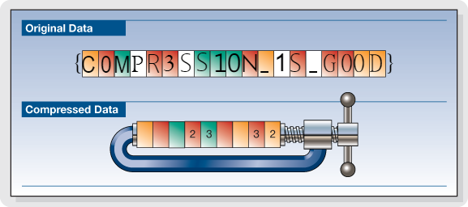

# YUBITSEC 2017 CTF run

- [YUBITSEC 2017 CTF run](#yubitsec-2017-ctf-run)
    - [reverse/gifted](#reversegifted)
    - [reverse/TheTwinTowers](#reversethetwintowers)
    - [reverse/reverse101](#reversereverse101)
    - [reverse / password](#reverse--password)
    - [forensic / File](#forensic--file)
    - [forensic / Cracking](#forensic--cracking)
    - [forensic / Cracking2](#forensic--cracking2)

## reverse/gifted

>> http://ctf.yubitsec.org/files/b37cfd3fbfb21dcdf3c42c31456fb4f7/gifted

Бърз разходка в дата сегмента на файла чрез и `rabin2` откриваме флага във [файла](files/gifted):

```
d3k4@d3k4-XPS:~/Documents/writeups/YUBITSecCTF/files$ ./gifted
Really?
d3k4@d3k4-XPS:~/Documents/writeups/YUBITSecCTF/files$ rabin2 -z gifted
vaddr=0x00400c05 paddr=0x00000c05 ordinal=000 sz=30 len=29 section=.rodata type=ascii string=YUBITSEC{MEH_IT_IS_SOMETHING}
vaddr=0x00400c23 paddr=0x00000c23 ordinal=001 sz=8 len=7 section=.rodata type=ascii string=Really?
```
флаг `YUBITSEC{MEH_IT_IS_SOMETHING}`( +50т).

## reverse/TheTwinTowers

>> http://ctf.yubitsec.org/files/3256d35917a58a3c493c4769692375ff/Wtf.class

Изтегляме java class-a - [Wtf.class](files/Wtf.class), и подобно на предната задача листваме всички printable characters и откриваме флага:

```bash
d3k4@d3k4-XPS:~/Documents/writeups/YUBITSecCTF/files$ rabin2 -z Wtf.class | grep YUBI
[X] r_bin_java_code_attr_new: Error unable to parse remainder of classfile after Method's Code Attribute: 1.
vaddr=0x000002a3 paddr=0x000002a3 ordinal=038 sz=28 len=25 section=unknown type=ascii string=0YUBITSEC{BUSH_DID_9_11}0
```
Ок тука избързахме, това не е флага :) отваряме файла с любимия java editor и виждаме кога на функцията `flag()` която не взема параметри като аргументи. 

```java
public static void flag()
  {
    String str1 = null;
    int i = 3;
    int j = 3;
    String str2 = null;
    j = 0 + j;

    if (j % 2 == 0) {
      String str3 = str2 + "error";
      String str4 = "Flag is not here actually...";
      String str5 = "59554249545345437B5730575F4D5543485F50524F4752414D4D494E475F4A4156417D";
    }
    else {
      int k = 59;
      int m = 554;
      int n = 249;
      int i1 = 545;
      int i2 = 345;
      int i3 = 437;

      String str6 = "B77";
      int i4 = 686;
      String str7 = "F5F757";

      str1 = Integer.toString(k) + Integer.toString(m) + Integer.toString(n) + Integer.toString(i1) + Integer.toString(i2) + Integer.toString(i3) + str6 + 
        Integer.toString(i4) + 
        str7 + "365735F6A6176615F696E5F323031377D";
    }

    System.out.println(str1);
  }
```

Ако нямате проблеми с четенето на код ще видите че този код не прави нищо освен че принтира този стринг `59554249545345437B5730575F4D5543485F50524F4752414D4D494E475F4A4156417D` които се оказва hex encoded флаг:

```
Python 2.7.12 (default, Nov 19 2016, 06:48:10) 
[GCC 5.4.0 20160609] on linux2
Type "help", "copyright", "credits" or "license" for more information.
>>> import binascii
>>> binascii.unhexlify('59554249545345437B5730575F4D5543485F50524F4752414D4D494E475F4A4156417D')
'YUBITSEC{W0W_MUCH_PROGRAMMING_JAVA}'
```
флаг: YUBITSEC{W0W_MUCH_PROGRAMMING_JAVA} (+125т.)

## reverse/reverse101

 >> Jump over it. http://ctf.yubitsec.org/files/0caf22dd1835d74acb1d8284a7ec9684/rev1

В този чалиндж имаме подсказка в името, трябва да се направи `jmp` в може би скрита функция, нека инвестигираме:

```
[0x00400610]> afl
0x00400000    2 25           sym.imp.__libc_start_main
0x00400598    3 23           sym._init
0x004005c0    2 16   -> 32   sym.imp.exit
0x004005d0    2 16   -> 48   sym.std::ios_base::Init::Init
0x004005e0    2 16   -> 48   sym.imp.__cxa_atexit
0x004005f0    2 16   -> 48   sym.std::ios_base::Init::_Init
0x00400600    2 16   -> 48   sym.std::operator___std::char_traits_char__
0x00400610    1 43           entry0
0x00400640    4 50   -> 41   sym.deregister_tm_clones
0x00400680    3 53           sym.register_tm_clones
0x004006c0    3 28           sym.__do_global_dtors_aux
0x004006e0    4 38   -> 35   sym.frame_dummy
0x00400706    1 19           sym.change_is_good # Това изглежда добър кандидат
0x00400719    4 588          main
0x00400965    4 62           sym.__static_initialization_and_destruction_0
0x004009a3    1 21           sym._GLOBAL__sub_I__Z14change_is_goodi # Това също
0x004009c0    4 101          sym.__libc_csu_init
0x00400a30    1 2            sym.__libc_csu_fini
0x00400a34    1 9            sym._fini
```
При анализ на `main` функцията можем да разберем че тя прави последнователни записи в stack-a на програмата(коментарите след анализа от `r2` направо си ги преводаха). Или можем да прегледаме данните от стака чрез динамичен анализ в `gdb` или IDA(but let's be hardcore).

```assembly
[-------------------------------------code-------------------------------------]
   0x400925 <main+524>:	lea    rcx,[rdx-0x1]
   0x400929 <main+528>:	mov    DWORD PTR [rax],0x7d
   0x40092f <main+534>:	lea    rdx,[rax+0x4]
=> 0x400933 <main+538>:	lea    rax,[rcx-0x1]
   0x400937 <main+542>:	test   rax,rax
   0x40093a <main+545>:	js     0x40094c <main+563>
   0x40093c <main+547>:	mov    DWORD PTR [rdx],0x0
   0x400942 <main+553>:	add    rdx,0x4
[------------------------------------stack-------------------------------------]
0000| 0x7fffffffda60 --> 0x5500000059 ('Y')
0008| 0x7fffffffda68 --> 0x4900000042 ('B')
0016| 0x7fffffffda70 --> 0x5300000054 ('T')
0024| 0x7fffffffda78 --> 0x4300000045 ('E')
0032| 0x7fffffffda80 --> 0x550000007b ('{')
0040| 0x7fffffffda88 --> 0x4500000053 ('S')
0048| 0x7fffffffda90 --> 0x470000005f ('_')
0056| 0x7fffffffda98 --> 0x4200000044 ('D')
[------------------------------------------------------------------------------]
gdb-peda$ hexdump 0x7fffffffda60 /8
0x00007fffffffda60 : 59 00 00 00 55 00 00 00 42 00 00 00 49 00 00 00   Y...U...B...I...
0x00007fffffffda70 : 54 00 00 00 53 00 00 00 45 00 00 00 43 00 00 00   T...S...E...C...
0x00007fffffffda80 : 7b 00 00 00 55 00 00 00 53 00 00 00 45 00 00 00   {...U...S...E...
0x00007fffffffda90 : 5f 00 00 00 47 00 00 00 44 00 00 00 42 00 00 00   _...G...D...B...
0x00007fffffffdaa0 : 5f 00 00 00 50 00 00 00 45 00 00 00 44 00 00 00   _...P...E...D...
0x00007fffffffdab0 : 41 00 00 00 5f 00 00 00 53 00 00 00 52 00 00 00   A..._...S...R...
0x00007fffffffdac0 : 53 00 00 00 4c 00 00 00 59 00 00 00 7d 00 00 00   S...L...Y...}...
0x00007fffffffdad0 : 00 00 00 00 00 00 00 00 00 00 00 00 00 00 00 00   ................

```
флаг: YUBITSEC{USE_GDB_PEDA_SRSLY} (+250т.)

## reverse / password 

> The flag is the password. (Integer) Flag format: YUBITSEC{}
http://ctf.yubitsec.org/files/1509f06c0eb0d0312b2bcd39fac52edb/rev2

Изтегляме си поредния [файл](files/rev2), оказва се типично `crackme`. Ето и пътищата произлизащи от `main` функцията:

```
                  0x400932  
                     f t
          .----------' '------.
          |                   |
          |                   |
       0x400983              0x4009a9  
                                f t
                     .----------' '------.
                     |                   |
                     |                   |
                  0x4009af              0x4009d5  
                                           f t
                                .----------' '------.
                                |                   |
                                |                   |
                             0x400a2c            [ 0x400a52 ]
                                                      f t
                                           .----------' '------.
                                           |                   |
                                           |                   |
                                        0x400a65              0x400a83  
                                       v
                                       |
                                       |
                                       |
                                        0x400aa9


``` 

Функцията от която се интересуваме се нарича: `0x0040090e sym.check_password`

```
[0x7fee27a67cc0]> pdf @ sym.check_password
┌ (fcn) sym.check_password 36
│   sym.check_password ();
│           ; var int local_14h @ rbp-0x14
│           ; var int local_4h @ rbp-0x4
│              ; CALL XREF from 0x00400a57 (sym.main)
│           0x0040090e      55             push rbp                    ; push word, doubleword or quadword onto the stack
│           0x0040090f      4889e5         mov rbp, rsp                ; moves data from src to dst
│           0x00400912      897dec         mov dword [local_14h], edi  ; moves data from src to dst
│           0x00400915      c745fcad0500.  mov dword [local_4h], 0x5ad ; Това е интересна стойност
│           0x0040091c      8b45ec         mov eax, dword [local_14h]  ; moves data from src to dst
│           0x0040091f      3b45fc         cmp eax, dword [local_4h]   ; compare two operands
│       ┌─< 0x00400922      7507           jne 0x40092b                ; jump short if not equal/not zero (zf=0)
│       │   0x00400924      b801000000     mov eax, 1                  ; moves data from src to dst
│      ┌──< 0x00400929      eb05           jmp 0x400930                ; jump
│      │└─> 0x0040092b      b800000000     mov eax, 0                  ; moves data from src to dst
│      │       ; JMP XREF from 0x00400929 (sym.check_password)
│      └──> 0x00400930      5d             pop rbp                     ; pops last element of stack and stores the result in argument
└           0x00400931      c3             ret                         ; return from subroutine. pop 4 bytes from esp and jump there.
```

Интересния ред след който идва сравнението е:

```
0x00400915      c745fcad0500.  mov dword [local_4h], 0x5ad ; 0x5ad = 1453
```

флаг: YUBITSEC{1453} (+250т.)


## forensic / File

Изтегляме [файла](files/File). Използваме `binwalk` за да проверим какви хедъри се намират в него и успяваме да извлечем 2 zip файла.

```bash
d3k4@d3k4-XPS:~/Documents/writeups/YUBITSecCTF/files$ binwalk File -e

DECIMAL       HEXADECIMAL     DESCRIPTION
--------------------------------------------------------------------------------
30            0x1E            Zip archive data, at least v1.0 to extract, compressed size: 11905297, uncompressed size: 11905297, name: File/Flag.zip
11905348      0xB5A944        End of Zip archive
11905370      0xB5A95A        Zip archive data, at least v2.0 to extract, compressed size: 20103, uncompressed size: 24875, name: File/YubitSec.jpg
11925801      0xB5F929        End of Zip archive
``` 
В единият от zip файловете откриваме и `png` файл съдържащ флага:



флаг: YUBITSEC{C0MPR3SS10N_1S_G00D} (+50т.)


## forensic / Cracking 

Изтегляме файла. И виждаме че това е ZIP файл с парола, когато видя такива CTF задачи без да се замислям започвам bruteforcing-а. За целта използвам: `frackzip`

```
d3k4@d3k4-XPS:~/Documents/writeups/YUBITSecCTF/files$ fcrackzip -D -p ~/wordlists/rockyou.txt -u Flag.zip
PASSWORD FOUND!!!!: pw == h0lyshit
```
флаг: YUBITSEC{3ASY_CR4CK_BR0_W3LL_D0N3} (+150)

## forensic / Cracking2

““ 

Отново заключен зип файл, и пак ще изпозлваме `frackzip`, тук обаче всяка позната парола ни води до нов заключен с парола zip файл:

Паролите са както следва:
```
10 - h0lishit
09 - hardrock
08 - superman
07 - zero
06 - !некриптиран
05 - 123456
04 - sleep
03 - tonight
02 - sexyboy
01 - spam
```

Имаме всички файлове, обаче сме пропуснали нещо - последния файл не съдържа флаг.
След 30минутно лутане забелязах че на всеки от `jpg` файлове който декриптираме има по един стринг в `base64` encoding. 

```
d3k4@d3k4-XPS:~/Documents/writeups/YUBITSecCTF/files$ for i in $(ls cracking2); do strings cracking2/$i | tail -1| base64 --decode ; done
TEVIL_CORPBI}SEC{YU  _WANTS_YOU
```

флаг: YUBITSEC{EVIL_CORP_WANTS_YOU} (+250)

Тъй като е събота вечер ще спра до тук с 1175 точки