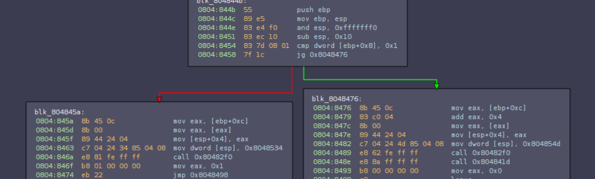

# Случайни crackmes

------



## Въведение и цел

Тези **crackmes** които ще решаваме са за да научим повече относно reverse engineering и като допълнение ще се опитам да разясня различни тулове за дебъгване и анализ.
Ще се опитам да реша всекa една от тези задачи посредством 'най-модерния'(защото сме модерни) terminal debugger - [radare2](https://github.com/radare/radare2) (RIP gdb). Ако всичко върви добре ще се опитам да разясня също така една от най-новите методи за решаване на такива задачи, а именно [Symbolic Execution](https://en.wikipedia.org/wiki/Symbolic_execution).


> Не че SymbolicExecution е нещо задължително ново, но в началото на 2017 отбори като **TrailOfBits** и **Shellphish** произведоха open-source тулове за решаване на такива проблеми. Това са [angr](https://github.com/angr/angr) и [manticore](https://github.com/trailofbits/manticore)

<!-- TOC -->

- [Случайни crackmes](#случайни-crackmes)
    - [Въведение и цел](#въведение-и-цел)
    - [crackme0x00](#crackme0x00)
    - [crackme0x01](#crackme0x01)
    - [crackme0x02](#crackme0x02)

<!-- /TOC -->


**<ОЧАКВАЙТЕ ПЪЛНАТА ВЕРСИЯ НА ТОЗИ WRITEUP НЕ ПО РАНО ОТ МЕСЕЦ :) ВСЕ ПАК РАБОТЯ>**

## crackme0x00

Ок, започваме с бърза загрявка. Първо да получим повече информация относно целта ни:

```bash
d3k4@d3k4-XPS:~/Documents/writeups/radare2_crackmes/crackmes$ ./crackme0x00
IOLI Crackme Level 0x00
Password: asdkasldkajsd
Invalid Password!
```
Нищо нестандартно, трябва да разбием паролата за да получим флага(btw: това е целта на всички файлове в директорията `crackmes/`).

Не занравяйте най добрия приятел на хакера - `strings` (търси printable characters в посочен файл). **Strings** някой недостатъци, който обаче липсват в **rabin2**(това е tool от budle-a на radare2).

И ето демострация на магията:

```
d3k4@d3k4-XPS:~/Documents/writeups/radare2_crackmes/crackmes$ rabin2 -z crackme0x00
vaddr=0x08048568 paddr=0x00000568 ordinal=000 sz=25 len=24 section=.rodata type=ascii string=IOLI Crackme Level 0x00\n
vaddr=0x08048581 paddr=0x00000581 ordinal=001 sz=11 len=10 section=.rodata type=ascii string=Password:
vaddr=0x0804858f paddr=0x0000058f ordinal=002 sz=7 len=6 section=.rodata type=ascii string=250382
vaddr=0x08048596 paddr=0x00000596 ordinal=003 sz=19 len=18 section=.rodata type=ascii string=Invalid Password!\n
vaddr=0x080485a9 paddr=0x000005a9 ordinal=004 sz=16 len=15 section=.rodata type=ascii string=Password OK :)\n
```
Ако сте отворили файла с radare2, командата която ви трябва е `iz`.

```
[0xf771aac0]> iz
vaddr=0x08048568 paddr=0x00000568 ordinal=000 sz=25 len=24 section=.rodata type=ascii string=IOLI Crackme Level 0x00\n
vaddr=0x08048581 paddr=0x00000581 ordinal=001 sz=11 len=10 section=.rodata type=ascii string=Password: 
vaddr=0x0804858f paddr=0x0000058f ordinal=002 sz=7 len=6 section=.rodata type=ascii string=250382
vaddr=0x08048596 paddr=0x00000596 ordinal=003 sz=19 len=18 section=.rodata type=ascii string=Invalid Password!\n
vaddr=0x080485a9 paddr=0x000005a9 ordinal=004 sz=16 len=15 section=.rodata type=ascii string=Password OK :)\n
```

Това е списъка с printable characters намиращи се в паметта на приложението(както виждате има и допълнителна информация относно vaddr, section, paddr, len, ...).

Единия от тези printable strings изглежда съмнителен и затова ще го използваме за да разберем дали е отговор на задачата:

```
d3k4@d3k4-XPS:~/Documents/writeups/radare2_crackmes/crackmes$ echo "250382" | ./crackme0x00
IOLI Crackme Level 0x00
Password: Password OK :)
```

----


## crackme0x01

Следващата задача е от същия тип:

```
d3k4@d3k4-XPS:~/Documents/writeups/radare2_crackmes/crackmes$ ./crackme0x01
IOLI Crackme Level 0x01
Password: sadasdasdaasd
Invalid Password!
```

Тук не ни помага подхода от предната задача. 

```
d3k4@d3k4-XPS:~/Documents/writeups/radare2_crackmes/crackmes$ rabin2 -z crackme0x01
vaddr=0x08048528 paddr=0x00000528 ordinal=000 sz=25 len=24 section=.rodata type=ascii string=IOLI Crackme Level 0x01\n
vaddr=0x08048541 paddr=0x00000541 ordinal=001 sz=11 len=10 section=.rodata type=ascii string=Password:
vaddr=0x0804854f paddr=0x0000054f ordinal=002 sz=19 len=18 section=.rodata type=ascii string=Invalid Password!\n
vaddr=0x08048562 paddr=0x00000562 ordinal=003 sz=16 len=15 section=.rodata type=ascii string=Password OK :)\n
```

Отваряме файла посредством `r2 -d ./crackme0x01`. След като заредите задачата в дебъгъра е добре да изпълните следната команда - `aa`, защо?

**аа** - командата означава 'analyze all' aka техника за извличане на информация посредством анализиране на assembly код(който не знае какво е assembly code или е нов в reverse engineering-a горещо препоръчвам безплатната книга на украйнския гуру Денис Юричев - [beginner.re](https://beginner.re)). Това означава че анализирайки структурата е възможно да се идентифицират basic blocks, function trees, opcodes и т.н.

След това ще изведем списък на наличните функций(basic blocks) посредством `afl`.

```bash
d3k4@d3k4-XPS:~/Documents/writeups/radare2_crackmes/crackmes$ radare2 -d crackme0x01 
Process with PID 30720 started...
= attach 30720 30720
bin.baddr 0x08048000
Using 0x8048000
Assuming filepath /home/d3k4/Documents/writeups/radare2_crackmes/crackmes/crackme0x01
asm.bits 32
 -- Warning, your trial license is about to expire.
[0xf777aac0]> aa
[x] Analyze all flags starting with sym. and entry0 (aa)
[0xf777aac0]> afl
0x080482d4    1 23           sym._init
0x080482fc    1 6            sym.imp.__libc_start_main
0x0804830c    1 6            sym.imp.scanf
0x0804831c    1 6            sym.imp.printf
0x08048330    1 33           entry0
0x08048354    3 33           fcn.08048354
0x08048380    6 47           sym.__do_global_dtors_aux
0x080483b0    4 50           sym.frame_dummy
0x080483e4    4 113          main
0x08048460    4 99           sym.__libc_csu_init
0x080484d0    1 5            sym.__libc_csu_fini
0x080484d5    1 4            sym.__i686.get_pc_thunk.bx
0x080484e0    4 35           sym.__do_global_ctors_aux
0x08048504    1 26           sym._fini
[0xf777aac0]>
```

Почти винаги фунцкията която ни интересува е `main`. Нега да погледнем assembly кода и:

```bash
[0xf777aac0]> pdf @ main
 (fcn) main 113
|   main ();
|           ; var int local_4h @ ebp-0x4
|           ; var int local_4h_2 @ esp+0x4
|              ; DATA XREF from 0x08048347 (entry0)
|           0x080483e4      55             push ebp
|           0x080483e5      89e5           mov ebp, esp
|           0x080483e7      83ec18         sub esp, 0x18
|           0x080483ea      83e4f0         and esp, 0xfffffff0
|           0x080483ed      b800000000     mov eax, 0
|           0x080483f2      83c00f         add eax, 0xf
|           0x080483f5      83c00f         add eax, 0xf
|           0x080483f8      c1e804         shr eax, 4
|           0x080483fb      c1e004         shl eax, 4
|           0x080483fe      29c4           sub esp, eax
|           0x08048400      c70424288504.  mov dword [esp], str.IOLI_Crackme_Level_0x01_n ; [0x8048528:4]=0x494c4f49 ; "IOLI Crackme Level 0x01."
|           0x08048407      e810ffffff     call sym.imp.printf        ; int printf(const char *format)
|           0x0804840c      c70424418504.  mov dword [esp], str.Password: ; [0x8048541:4]=0x73736150 ; "Password: "
|           0x08048413      e804ffffff     call sym.imp.printf        ; int printf(const char *format)
|           0x08048418      8d45fc         lea eax, [local_4h]
|           0x0804841b      89442404       mov dword [local_4h_2], eax
|           0x0804841f      c704244c8504.  mov dword [esp], 0x804854c  ; [0x804854c:4]=0x49006425
|           0x08048426      e8e1feffff     call sym.imp.scanf         ; int scanf(const char *format)
|           0x0804842b      817dfc9a1400.  cmp dword [local_4h], 0x149a ; [0x149a:4]=-1
|       ,=< 0x08048432      740e           je 0x8048442
|       |   0x08048434      c704244f8504.  mov dword [esp], str.Invalid_Password__n ; [0x804854f:4]=0x61766e49 ; "Invalid Password!."
|       |   0x0804843b      e8dcfeffff     call sym.imp.printf        ; int printf(const char *format)
|      ,==< 0x08048440      eb0c           jmp 0x804844e
|      |`-> 0x08048442      c70424628504.  mov dword [esp], str.Password_OK_:__n ; [0x8048562:4]=0x73736150 ; "Password OK :)."
|      |    0x08048449      e8cefeffff     call sym.imp.printf        ; int printf(const char *format)
|      |       ; JMP XREF from 0x08048440 (main)
|      `--> 0x0804844e      b800000000     mov eax, 0
|           0x08048453      c9             leave
\           0x08048454      c3             ret
```

Ако този мод не е четим можем да прегледаме assembly кода и във VisualMode(VV) - `VV @ main`.

```

                             .-------------------------------------------------.
                             | [0x80483e4] ;[gd]                               |
                             |   ;-- main:                                     |
                             | (fcn) main 113                                  |
                             |   main ();                                      |
                             | ; var int local_4h @ ebp-0x4                    |
                             | ; var int local_4h_2 @ esp+0x4                  |
                             |    ; DATA XREF from 0x08048347 (entry0)         |
                             | push ebp                                        |
                             | mov ebp, esp                                    |
                             | sub esp, 0x18                                   |
                             | and esp, 0xfffffff0                             |
                             | mov eax, 0                                      |
                             | add eax, 0xf                                    |
                             | add eax, 0xf                                    |
                             | shr eax, 4                                      |
                             | shl eax, 4                                      |
                             | sub esp, eax                                    |
                             |    ; [0x8048528:4]=0x494c4f49                   |
                             |    ; "IOLI Crackme Level 0x01."                 |
                             | mov dword [esp], str.IOLI_Crackme_Level_0x01_n  |
                             | call sym.imp.printf ;[ga]                       |
                             |    ; [0x8048541:4]=0x73736150                   |
                             |    ; "Password: "                               |
                             | mov dword [esp], str.Password:                  |
                             | call sym.imp.printf ;[ga]                       |
                             | lea eax, [local_4h]                             |
                             | mov dword [local_4h_2], eax                     |
                             |    ; [0x804854c:4]=0x49006425                   |
                             | mov dword [esp], 0x804854c                      |
                             | call sym.imp.scanf ;[gb]                        | << въвежда се стойност от stdin
                             |    ; [0x149a:4]=-1                              | 
                             | cmp dword [local_4h], 0x149a                    | << сравняват се стойностите на въведената стойност и 0x149a
                             | je 0x8048442 ;[gc]                              | << проверка на сравнението 
                             |                                                 |
                             `-------------------------------------------------'
                                     f t
                .--------------------' '------------------------.
                |                                               |
                |     Грешна парола                             | Вярна парола
        .-------------------------------------------.     .----------------------------------------.
        |  0x8048434 ;[gf]                          |     |  0x8048442 ;[gc]                       |
        |      ; [0x804854f:4]=0x61766e49           |     |      ; [0x8048562:4]=0x73736150        |
        |      ; "Invalid Password!."      <<<<     |     |      ; "Password OK :)."        <<<<   |
        | mov dword [esp], str.Invalid_Password__n  |     | mov dword [esp], str.Password_OK_:__n  |
        | call sym.imp.printf ;[ga]                 |     | call sym.imp.printf ;[ga]              |
        | jmp 0x804844e ;[ge]                       |     `----------------------------------------'
        `-------------------------------------------'         v
            v                                                 |
            '------------------------.------------------------'
                                     |
                                     |
                                 .----------------------------------------.
                                 |  0x804844e ;[ge]                       |
                                 |      ; JMP XREF from 0x08048440 (main) |
                                 | mov eax, 0                             |
                                 | leave                                  |
                                 | ret                                    |
                                 `----------------------------------------'
```

От този изглед директно се вижда къде се прави проверката дали въведения стринг от клиента отговаря на паролата - 0x149a (4 hex байта).

```
d3k4@d3k4-XPS:~/Documents/writeups/radare2_crackmes/crackmes$ rax2 0x149a
5274
d3k4@d3k4-XPS:~/Documents/writeups/radare2_crackmes/crackmes$ echo "5274" | ./crackme0x01
IOLI Crackme Level 0x01
Password: Password OK :)
```
Забравих да спомена че `rax2` е тул от сега на radare2 представляващ терминален **minimalistic expression evaluator**.

## crackme0x02

Следващата задаче е както споменахме от същия вид, и ще се опитам да ви покажа нещо интересно. Нега прегледаме assembly кода на main функцията в часта след `sym.imp.scanf`.

```
          | call sym.imp.scanf ;[gb]                        | << input от stdin
          |    ; 'Z'                                        |
          | mov dword [local_8h], 0x5a                      | ; 0x5a = 90
          | mov dword [local_ch], 0x1ec                     | ; 0x1ec = 492
          | mov edx, dword [local_ch]                       | << следват малко аритметични операций
          | lea eax, [local_8h]                             |    
          | add dword [eax], edx                            |    
          | mov eax, dword [local_8h]                       |
          | imul eax, dword [local_8h]                      |
          | mov dword [local_ch], eax                       |
          | mov eax, dword [local_4h]                       | << до тук
          | cmp eax, dword [local_ch]                       |
          | jne 0x8048461 ;[gc]                             |
          `-------------------------------------------------'
                  f t
 .----------------' '-----------------------.
 |                                          |
 |                                          |
-------------------------------.      .-------------------------------------------.
0x8048453 ;[gf]                |      |  0x8048461 ;[gc]                          |
onst char * format             |      |      ; const char * format                |
0x804856f:4]=0x73736150        |      |      ; [0x804857f:4]=0x61766e49           |
Password OK :)."               |      |      ; "Invalid Password!."               |
```

Както може би всички са се досетили можем да проследим бинарните опраций който се случват с `90` и `492`. За да знаем с какво число трябва да сравним нашия input по време на `cmp` инструкцията. Но има и още един вариант - да решим задачата чрез bruteforcing на избран път на изпълнение(preffered execution path). За целта ще използвам **angr tool**([документацията тук](https://docs.angr.io/)) от **Shellphish**.

Как, какво и защо? Нека прегледаме следната инструкция `jne 0x8048461`(jump if not equal), тя преглежда резутата от `cmp` инструкцията и предприема `jmp` към един от двата адреса `0x8048453` или `0x8048461`. Можем да се досетим че ако сме въвели правилния input(паролата) трябва да стигнем адреса `0x8048453` и да се опитаме да избягваме достигането на адрес `0x8048461` по време на изпълнението.

Как може да стане това? Посредством Symbolic Execution. Малко разясение относно какво е това - метод за анализиране на изпълняема програма и по-специално какви inputs пораждат различни части от кода да се изпълнят(предварително се извинявам ако не звучи академично, но много термини от ми убягват). Така наречения `преводач`(interpreter) следи изпълненито на програмата като приема symbolic(символични или символни) стойности като input, анализира резултата и прави сравнение между различните състояния по време на изпълненито. Това се прави за последващ анализ и извличане на логика от изпълнението посредством този абстрактен анализ.

С сега ще ви демонстрирам колко лесно е да се направи това с `angr`. Това е [нужния код](crackme0x02.py) за решаването на 

```python
#!/usr/bin/env python

import angr

# 1. Зареждаме файла в angr
p = angr.Project('crackmes/crackme0x02')

# 2. Голяма част от процеса по анализиране и разбиране изисква да се провери и разбере какво 
# точно прави част от кода(какво е семантичното му значение).
#
# SimuVEX е енжхина улеснявяш този процес - разбира какво точно прави определен VEX код в 
# текущото състояние на изпълнение на програмата. 
#  - p.factory - е контейнер за заредения обект/проект 
#  - p.factory.path.group() - създава path_group; Това е `умен` списък с различни пътища 
#                             изпълнявани едновременно
# 
# Та, следващата част от кода ни е зареждане на всички такива пътища който ще бъдат изпълнявани 
# едновременно.
pg = p.factory.path_group()

# Частите от angr който отгаварят за Symbolic Execution с 'цел' се наричат Surveyors и Explorer е
# един от тези тулове. И какво прави Explorer - търси специфичен адреси, стрингове и т.н. докато 
# избягва други такива.
# 
# Какво се опитваме да направим със следващия ред код - Опитваме се открием  s"OK :)" , намираш се
# в блока на 0x8048453 и в същото време се опитваме да избягваме адрес 0x8048461 - блока които се 
# достига ако паролата ни е грешна(погледнете предната диаграма от Visual mode-ът на radare2).
pg.explore(avoid=(0x8048461,), find=lambda p: "OK :)" in p.state.posix.dumps(1))

# Ако има успешно намерени пътища те ще се намират в списака 'pg.found'
# A часта което ни интерува е състоянието на изпълнение или така наречения state
s = pg.found[0].state

# Така и не съм разбал какво точно е значението на s.posix.dumps(0) или (1), но в общи линий него аз
# си го превеждам като последните редове от stdin и stiout преди достигането на предварително зададе-
# ната цел.
print("Otgovor: %s" % s.posix.dumps(0))
```

Честито, със 6 реда код без много мислене по binary аритметика успяхме да решим 3тата задача от списъка.

