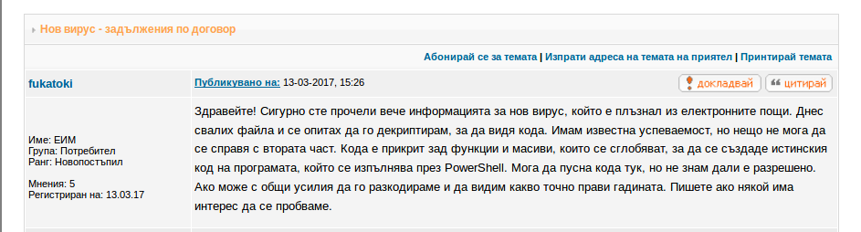
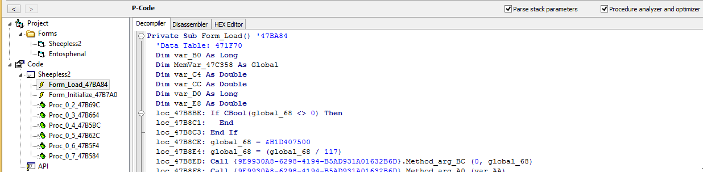
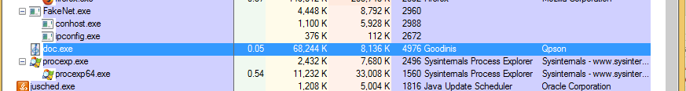
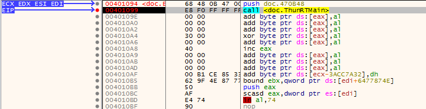

# Random Malware Analysis

## рандом крипто [вирус](http://forums.bgdev.org/index.php?showtopic=49142&st=0)


## Статичен анализ

Някой вече се беше занимавал със задачката(fukatoki), неговия анализ се оказа правилен. 
* 1вата част от процеса по заразяване е да бъде изтеглен JSE файл - дропър.
* 2рата част - след изпълнение на дропъра той тегли файл от - http://www.groupcreatedt.at/doc.bin

Изтегляме файла и започваме анализа

```bash
d3k4@d3k4-XPS:/tmp$ file doc.bin 
doc.bin: PE32 executable (GUI) Intel 80386, for MS Windows

d3k4@d3k4-XPS:/tmp$ objdump -h doc.bin 

doc.bin:     file format pei-i386

Sections:
Idx Name          Size      VMA       LMA       File off  Algn
  0 .text         0007abd8  00401000  00401000  00001000  2**2
                  CONTENTS, ALLOC, LOAD, READONLY, CODE
  1 .data         00000000  0047c000  0047c000  00000000  2**2
                  ALLOC, LOAD, DATA
  2 .rsrc         00003498  0047e000  0047e000  0007c000  2**2
                  CONTENTS, ALLOC, LOAD, READONLY, DATA

d3k4@d3k4-XPS:/tmp$ binwalk -v doc.bin 

Scan Time:     2017-03-14 11:15:14
Target File:   /tmp/doc.bin
MD5 Checksum:  af6e225c95828f3bcdcf70c939f89a82
Signatures:    344

DECIMAL       HEXADECIMAL     DESCRIPTION
--------------------------------------------------------------------------------
0             0x0             Microsoft executable, portable (PE)
11213         0x2BCD          PC bitmap, Windows 3.x format,, 568 x 263 x 24

```


Дотук нищо неочаквано имаме PE 32 bit - Visual Basic 5-6.0 Form Application. Reverse Engineering и активен анализ на VB вируси е много неудобен и труден за следене в debugger, ама какво пък имаме време. 

За по любознателните [Алекс Йонеско](http://www.alex-ionescu.com) има много добро пояснения в [този гайд](http://web.archive.org/web/20071020232030/http://www.alex-ionescu.com/vb.pdf).

Да не забравяме че VB е просто един wrapper около Windows native calls, следователно че видим заредени много стандартни библиотеки.

Това са библиотеките които се използват:

```bash
DLL Loaded: 77C20000 C:\Windows\SysWOW64\ntdll.dll
DLL Unloaded: 00490000 
DLL Unloaded: 75C20000 
DLL Unloaded: 00490000 
DLL Unloaded: 00490000 
DLL Loaded: 75C20000 C:\Windows\SysWOW64\kernel32.dll
DLL Loaded: 77240000 C:\Windows\SysWOW64\KernelBase.dll
DLL Loaded: 71940000 C:\Windows\SysWOW64\apphelp.dll
DebugString: "SHIMVIEW: ShimInfo(Complete)\r\n"
DLL Loaded: 66000000 C:\Windows\SysWOW64\msvbvm60.dll
DLL Loaded: 75DB0000 C:\Windows\SysWOW64\user32.dll
DLL Loaded: 759B0000 C:\Windows\SysWOW64\gdi32.dll
DLL Loaded: 771C0000 C:\Windows\SysWOW64\advapi32.dll
DLL Loaded: 75870000 C:\Windows\SysWOW64\ole32.dll
DLL Loaded: 755E0000 C:\Windows\SysWOW64\oleaut32.dll
DLL Loaded: 75510000 C:\Windows\SysWOW64\msvcrt.dll
DLL Loaded: 75820000 C:\Windows\SysWOW64\sechost.dll
DLL Loaded: 776A0000 C:\Windows\SysWOW64\rpcrt4.dll
DLL Loaded: 77760000 C:\Windows\SysWOW64\combase.dll
DLL Loaded: 75420000 C:\Windows\SysWOW64\sspicli.dll
DLL Loaded: 75410000 C:\Windows\SysWOW64\cryptbase.dll
DLL Loaded: 753B0000 C:\Windows\SysWOW64\bcryptprimitives.dll
System breakpoint reached!
```

В набора ми с инструменти имам [VB Decompiler](https://www.vb-decompiler.org/), с който ще декомпилирам вируса(както споменахме не е пакетиран или обфускиран). 



Добре е по време на следващата част да имаме декомпилирания код за да можем да следим изпълнението по-ефективно.

### Динамичен анализ

Приготвяме си виртуалната машина(контролираната среда). Много е важно да си направим Snapshot преди да изпълним файла - това е нашия Quick Save който ще ни позволи да се дезинфектираме бързо от изпълнението на вируса.

Ето го процеса:


Пуснах [FakeNet](2017-03-14-16-20-33.png) да хвана дали изпраща някакви сигнали към C&C, все още нищо. Добре е да си имаме и един Wireshark в бакграунда.

С програмки като Regshot можем да видим какви точно промени прави вируса по системата ви - ето го моя [резултат](files/changes.htm), общо 62 промени.

<да се допълни с пояснения>


Аз използвам x32dbg. Стартираме приложението и скагаме брейк пойнт на: `0x00401099`

```
00401099       | E8 F0 FF FF FF    | call <doc.ThunRTMain>     # Main() функция                                   |
```


продължаваме...