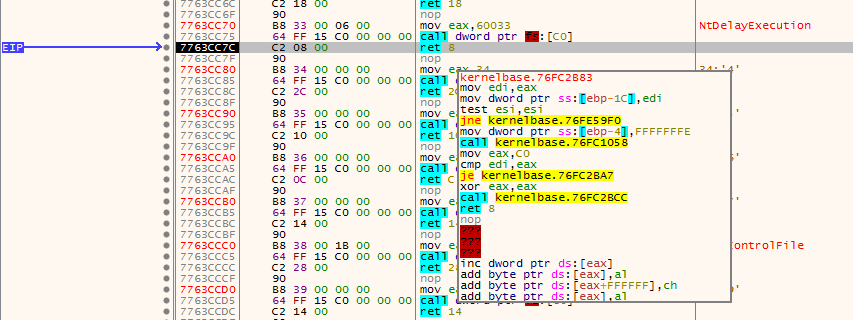

# Random Malware Analysis

<!-- TOC -->

- [Random Malware Analysis](#random-malware-analysis)
    - [Начало](#начало)
    - [Статичен анализ](#статичен-анализ)
    - [Динамичен анализ](#динамичен-анализ)

<!-- /TOC -->

## Начало
рандом крипто [вирус](http://forums.bgdev.org/index.php?showtopic=49142&st=0)


## Статичен анализ

Някой вече се беше занимавал със задачката(fukatoki), неговия анализ се оказа правилен. 
* 1вата част от процеса по заразяване е да бъде изтеглен JSE файл - дропър.
* 2рата част - след изпълнение на дропъра той тегли файл от - http://www.groupcreatedt.at/doc.bin

Изтегляме файла и започваме анализа

```bash
d3k4@d3k4-XPS:/tmp$ file doc.bin 
doc.bin: PE32 executable (GUI) Intel 80386, for MS Windows

d3k4@d3k4-XPS:/tmp$ objdump -h doc.bin 

doc.bin:     file format pei-i386

Sections:
Idx Name          Size      VMA       LMA       File off  Algn
  0 .text         0007abd8  00401000  00401000  00001000  2**2
                  CONTENTS, ALLOC, LOAD, READONLY, CODE
  1 .data         00000000  0047c000  0047c000  00000000  2**2
                  ALLOC, LOAD, DATA
  2 .rsrc         00003498  0047e000  0047e000  0007c000  2**2
                  CONTENTS, ALLOC, LOAD, READONLY, DATA

d3k4@d3k4-XPS:/tmp$ binwalk -v doc.bin 

Scan Time:     2017-03-14 11:15:14
Target File:   /tmp/doc.bin
MD5 Checksum:  af6e225c95828f3bcdcf70c939f89a82
Signatures:    344

DECIMAL       HEXADECIMAL     DESCRIPTION
--------------------------------------------------------------------------------
0             0x0             Microsoft executable, portable (PE)
11213         0x2BCD          PC bitmap, Windows 3.x format,, 568 x 263 x 24

```
`Strings` също не ни помогна за статичния анализ, ето интересните попадения след изпълнението му:

```
C:\Program Files (x86)\Microsoft Visual Studio\VB98\VB6.OLB
```
Според мен това се използва за проверка дали версията отговаря на изискванията за да се изпълни успешно вируса.


Дотук нищо неочаквано имаме PE 32 bit - Visual Basic 5-6.0 Form Application. Reverse Engineering и активен анализ на VB вируси е много неудобен и труден за следене в debugger, ама какво пък имаме време. 

За по любознателните [Алекс Йонеско](http://www.alex-ionescu.com) има много добро пояснения в [този гайд](http://web.archive.org/web/20071020232030/http://www.alex-ionescu.com/vb.pdf).

Да не забравяме че VB е просто един wrapper около Windows native calls, следователно че видим заредени много стандартни библиотеки.

Това са библиотеките които се използват:

```bash
DLL Loaded: 77C20000 C:\Windows\SysWOW64\ntdll.dll
DLL Unloaded: 00490000 
DLL Unloaded: 75C20000 
DLL Unloaded: 00490000 
DLL Unloaded: 00490000 
DLL Loaded: 75C20000 C:\Windows\SysWOW64\kernel32.dll
DLL Loaded: 77240000 C:\Windows\SysWOW64\KernelBase.dll
DLL Loaded: 71940000 C:\Windows\SysWOW64\apphelp.dll
DebugString: "SHIMVIEW: ShimInfo(Complete)\r\n"
DLL Loaded: 66000000 C:\Windows\SysWOW64\msvbvm60.dll
DLL Loaded: 75DB0000 C:\Windows\SysWOW64\user32.dll
DLL Loaded: 759B0000 C:\Windows\SysWOW64\gdi32.dll
DLL Loaded: 771C0000 C:\Windows\SysWOW64\advapi32.dll
DLL Loaded: 75870000 C:\Windows\SysWOW64\ole32.dll
DLL Loaded: 755E0000 C:\Windows\SysWOW64\oleaut32.dll
DLL Loaded: 75510000 C:\Windows\SysWOW64\msvcrt.dll
DLL Loaded: 75820000 C:\Windows\SysWOW64\sechost.dll
DLL Loaded: 776A0000 C:\Windows\SysWOW64\rpcrt4.dll
DLL Loaded: 77760000 C:\Windows\SysWOW64\combase.dll
DLL Loaded: 75420000 C:\Windows\SysWOW64\sspicli.dll
DLL Loaded: 75410000 C:\Windows\SysWOW64\cryptbase.dll
DLL Loaded: 753B0000 C:\Windows\SysWOW64\bcryptprimitives.dll
System breakpoint reached!
```

В набора ми с инструменти имам [VB Decompiler](https://www.vb-decompiler.org/), с който ще декомпилирам вируса(както споменахме не е пакетиран или обфускиран). 


Добре е по време на следващата част да имаме декомпилирания код за да можем да следим изпълнението по-ефективно.

-----------

## Динамичен анализ

Приготвяме си виртуалната машина(контролираната среда). Много е важно да си направим Snapshot преди да изпълним файла - това е нашия Quick Save който ще ни позволи да се дезинфектираме бързо от изпълнението на вируса.

Ето го процеса:


Пуснах [FakeNet](images/2017-03-14-16-20-33.png) да хвана дали изпраща някакви сигнали към C&C, все още нищо. Добре е да си имаме и един Wireshark в бакграунда.

С програмки като Regshot и Procmon.exe(Sysinternals) можем да видим какви точно промени прави вируса по системата ви:

  1. Резултатите от Regshot: [1](files/changes_x86.txt) и [2](files/changes2_x86.txt). Оказа се че файлът първоначално си бърка по регистрите за да се забие и стане persistent, след което се рестартира.
  
  2. Резултата от **Procmon** tracing-ът: [1](files/logfile.csv)

За да разберем какво точно правят всичките мапнати(имената на фунцкийте са адреси в памета на вируса), че е необходимо да отворим декомпилирания код и дебъгър.

Аз използвам x32dbg. Стартираме приложението и скагаме брейк пойнт на: `0x00401099`

```
00401099       | E8 F0 FF FF FF    | call <doc.ThunRTMain>     # Main() функция                                   |
```


Ето го и прозореца с декомпилирания код, подчертал съм важните за нас функций(Form_) и процеси(Proc). 6 цифрените hex числа са 32битовите адреси където се помещава изпълнимия код. Всички са част от '.data' сегмента на вируса:


За да разбера какви са точно тези функций и процеси, ще поставя breakpoints на всички тези адреси от паметта:

```
Code -> Sheepless2 -> Form_Load_47BA84 # 0x47BA84
Code -> Sheepless2 -> Form_Initialize_47B7A0 # 0x47B7A0
Code -> Sheepless2 -> Proc_0_2_47B69C # 0x47B69C
Code -> Sheepless2 -> Proc_0_3_47B664 # 0x47B664
Code -> Sheepless2 -> Proc_0_4_47B5BC # 0x47B5BC
Code -> Sheepless2 -> Proc_0_5_47B62C # 0x47B62C
Code -> Sheepless2 -> Proc_0_6_47B5F4 # 0x47B5F4
Code -> Sheepless2 -> Proc_0_7_47B584 # 0x47B584
```

Въобще не можах да стигна до тези брейкпоинти по време на изпълнението, след като паузирах дебъгинга се озовах на:

```
7763CC70 | B8 33 00 06 00           | mov eax,60033            
```



Стандартна библиотека: NtDelayExecution(милисекунди) т.е 0x60033 --> 393267 милисекунди --> 393сек --> 6:33мин. Това е забавянето след което мауеъра продължава.


-------

Записки:

Това е push-нато на стака:
```
0018F8C0  00471FE4  &L"0D};0804:{81D4E9C9-1D3B-41BC-9E6C-4B40BF79E35E}{FA550B04-5AD7-411f-A5AC-CA038EC515D7}"
```
след кратка справка с Google разбираме че това е:

**Windows Language Pack Default Values**
Language | Default Value | 
---------|----------|
 Chinese - PRC | zh-CN: Microsoft Pinyin - Simple Fast (0804:{81D4E9C9-1D3B-41BC-9E6C-4B40BF79E35E}{FA550B04-5AD7-411f-A5AC-CA038EC515D7}) 


